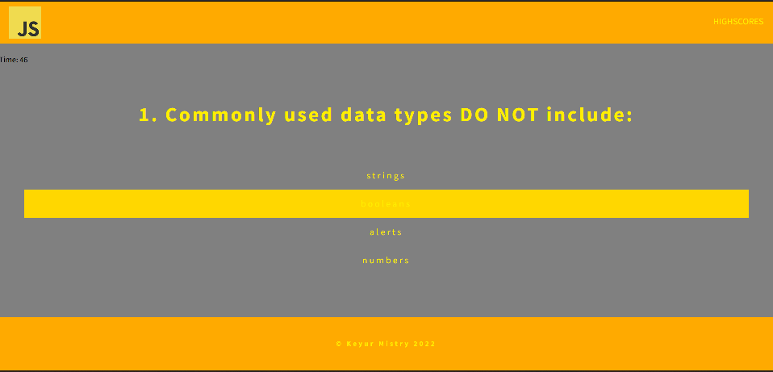
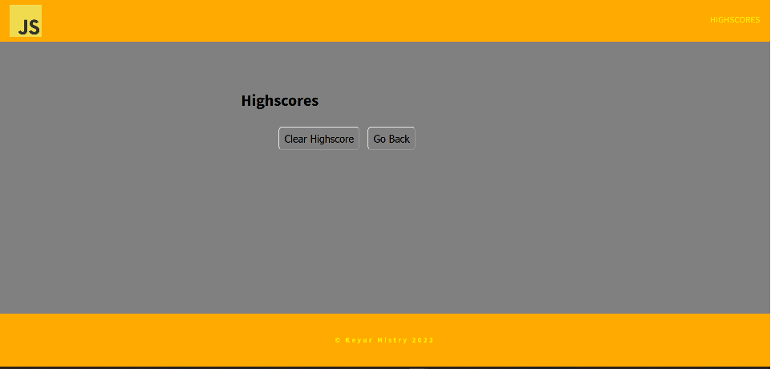

# Javascript-Quiz

For this homework we were tasked with creating a Code Quiz by using javascript. The criteria for the quiz were as follows:

```
GIVEN I am taking a code quiz
WHEN I click the start button
THEN a timer starts and I am presented with a question
WHEN I answer a question
THEN I am presented with another question
WHEN I answer a question incorrectly
THEN time is subtracted from the clock
WHEN all questions are answered or the timer reaches 0
THEN the game is over
WHEN the game is over
THEN I can save my initials and my score
```

The bulk of the homework was done through javascript, as it allowed the quiz to start, make questions appear one after the other, allowed for a timer to be introduced, to collect user data and store it in the local storage and many more uses.

Link to quiz: https://keyurmist.github.io/Javascript-Quiz/highscore.html


Below is an image to show the start loading screen of the quiz. Here we can see that the start button is used to initiate the quiz and also a highscore link is shown on the top right.


Below is an image to show what the questions look like. A timer is introduced on the left of the screen and it starts at 50s. 



Below is an image to show what the highscore tab would show. A button to go back to the start and one to clear the highscore table.


Although I managed to meet some of the criteria, this homework was especially long winded and difficult and I was unable to complete it. However, I now know where my weaknesses lie and will surely address them.